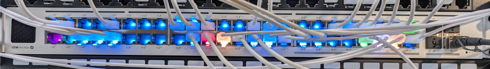

# unifi-etherlight-profiles

This simple script aims to make Unifis Etherlighting more useful for everyday use.
As for October 2026, Unifi let you only configure a color per native vlan and it is only shown if the port is connected.

One more useful feature that this script implements is that you have a color per port profile and the color is visible even if the port is down.
This makes it very easy to plug in new devices based on the port color.

Ports with no link have a lower brightness which you can configure to distinguish them from active ports.



## Disclaimer

This script writes to undocumented `/proc/led/*` interfaces over SSH. This may conflict with Ubiquiti's Terms of Service and may affect your warranty. Use it at your own risk and test on a non-critical switch first. Firmware updates can change or break the interface.

Tested with:

- UniFi OS Server 5.1.42
- USW Pro Max 48 PoE (LED driver version 1.19.4)
- Debian, Python 3

Other Etherlighting switches may work, but port numbering and LED files can differ.

## How it works

Every `interval_s` seconds the script does the following:

1. Reads port profiles, port assignments and link state from the UniFi Network API (API key).
2. Maps the profile name of each port to a color from `config.yaml`.
3. Connects to the switch via SSH and checks `/proc/led/led_mode`. If the controller reset it (e.g. after provisioning), it is set back to `0`.
4. Writes the r/g/b/w channels of every port to `/proc/led/led_color`. Ports with link use `brightness_link`, ports without link use `brightness_nolink`.

Because all ports are rewritten each cycle, colors that the controller overwrote come back automatically within one interval.

`led_code` is not used, because on the tested firmware it only produced dim white for single ports. `led_color` sets one channel per write, so the script sets all four channels (r, g, b, w) explicitly.

## Requisites

```bash
apt install python3-requests python3-yaml openssh-client
```

## Setup

### 1. Create an API key

In the UniFi Network application, create an API key (in current versions under *Settings → Control Plane → Integrations*; the exact location may vary by version). Copy it into `config.yaml`.

### 2. Enable SSH on the switch

Enable device SSH authentication in the UniFi Network settings (usually under *Settings → System → Advanced*) and add the public key of the script host. Then check that this works without a password:

```bash
ssh -i /opt/etherlight-profiles/id_rsa admin@192.168.1.10 "cat /proc/led/led_mode"
```

Create a key pair if you do not have one yet:

```bash
install -d /opt/etherlight-profiles
ssh-keygen -t rsa -b 4096 -f /opt/etherlight-profiles/id_rsa -N ""
```

### 3. Install the files

Copy `etherlight_profiles.py` and `config.yaml` to `/opt/etherlight-profiles/`.

### 4. Create a dedicated user

```bash
useradd -r -s /usr/sbin/nologin unifi
chown -R unifi /opt/etherlight-profiles
chmod 600 /opt/etherlight-profiles/id_rsa /opt/etherlight-profiles/config.yaml
```

## Configuration (`config.yaml`)

```yaml
controller:
  url: [https://192.168.1.1](https://192.168.1.1)        # UniFi OS Server
  api_key: "YOUR_API_KEY"
  site: default
  verify_tls: false               # set true if you use a trusted certificate
switch:
  mac: "aa:bb:cc:dd:ee:ff"        # MAC address of the switch in UniFi
  ssh_host: 192.168.1.10
  ssh_user: admin
  ssh_key: /opt/etherlight-profiles/id_rsa
interval_s: 10                    # seconds between two cycles
brightness_link: 100              # percent (1-100) for ports with link
brightness_nolink: 15             # percent (1-100) for ports without link
default_color: "ffffff"           # used for profiles not listed below
profiles:                         # port profile name -> color (hex RGB)
  "All": "00aaff"
  "IoT": "ff8800"
  "Server": "00ff00"
  "Management": "ff0000"
```

| Key | Meaning |
|---|---|
| `controller.url` | Base URL of the UniFi OS Server |
| `controller.api_key` | API key, sent as `X-API-KEY` |
| `controller.site` | Site name (internal name, usually `default`) |
| `switch.mac` | Selects the switch in the device list |
| `interval_s` | Cycle time in seconds |
| `brightness_link` / `brightness_nolink` | Power level in percent |
| `default_color` | Color for ports whose profile is not in `profiles` |
| `profiles` | Profile name (exactly as in UniFi) to hex color |

Brightness is scaled linearly. A low value like 15 % can still look bright to the eye, so values around 5 % to 10 % may separate link and no link better.

## Test manually first

Run the script in the foreground:

```bash
sudo -u unifi python3 /opt/etherlight-profiles/etherlight_profiles.py /opt/etherlight-profiles/config.yaml
```

Check that:

- every port shows the color of its profile,
- ports with link are brighter than ports without link,
- ports with a profile that is not in `config.yaml` are white,
- the colors stay stable between cycles.

## Run as a service

Use the service file in `/etc/systemd/system/etherlight-profiles.service`

and enable with `systemctl enable --now etherlight-profile`

## Troubleshooting

| Symptom | Possible cause |
|---|---|
| `Cycle failed: 401` or `403` | Wrong or missing API key |
| `Cycle failed: StopIteration` | `switch.mac` does not match any device |
| SSH errors in the log | Key not authorized on the switch, wrong user or host |
| Ports without link stay dark | `led_mode` was reset to `1`; the script sets it back in the next cycle |
| Colors mixed with white | Not all channels set; the script sets `w` to `0` explicitly |
| Wrong profile color | Profile name in `config.yaml` differs from the name in UniFi |
| Wrong port lit | Port index and LED index may differ on your model |

After provisioning, the controller may reset the LEDs. The script restores them within `interval_s` seconds. The log shows a line whenever `led_mode` had to be corrected.

## Credits

Based on the research of [adamjezek98/ubnt-etherlighting](https://github.com/adamjezek98/ubnt-etherlighting) and [robherley/etherlighter](https://github.com/robherley/etherlighter) for controlling the LEDs over SSH.
